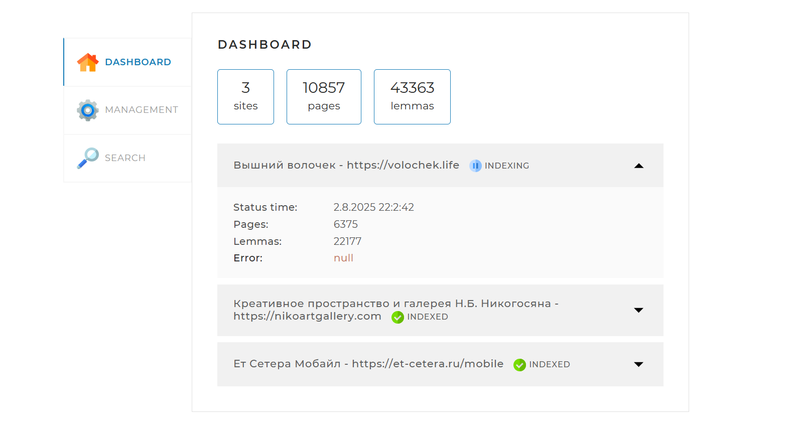

# 🔎 SearchEngine — Поисковый движок на Spring Boot

Сервис для индексирования сайтов и выполнения поисковых запросов.
Проект демонстрирует использование Spring Boot и MySQL для создания
поискового движка с функцией кэширования и многопоточной индексацией.

## 🚀 Стек технологий

- **Java 17**
- **Spring Boot 3**
- **Spring Data JPA**
- **MySQL**
- **Thymeleaf**
- **Jsoup**
- **Lucene Morphology**
- **Caffeine Cache**
- **Log4j2**
- **Maven**
- **Liquibase**

## ⚙️ Основные фишки

- **Собственный скрапер на Jsoup**  
  Обходит страницы сайтов, парсит HTML и извлекает содержимое для последующей лемматизации.

- **Многопоточная индексация с ForkJoinPool**  
  Благодаря `ForkJoinPool`, все страницы обрабатываются параллельно, а нагрузка на потоки распределяется равномерно.  
  Это значительно ускоряет построение поисковой базы даже при большом объёме данных.

- **Пакетная обработка лемм и индексов**  
  При массовой вставке данных (лемм и индексов) используется пакетный подход. Это помогает сократить количество транзакций и повысить производительность.

- **Кэширование поисковых запросов с Caffeine**  
  Популярные запросы кешируются, что позволяет мгновенно возвращать результаты при повторном поиске и снижает нагрузку на сервер и БД.

- **Реальное отображение статуса индексации**  
  Вы можете наблюдать за процессом индексации сайта в реальном времени и даже в этот момент выполнять поиск.  
  

  Это особенно удобно при работе с крупными сайтами и активной разработке.
  

## 📦 Как запустить локально

1. Установите **Java 17**, **Maven** и запустите **MySQL**.
2. Создайте базу данных `search_engine` и укажите имя пользователя и пароль в `src/main/resources/application.yaml`.
3. Соберите и запустите приложение:

```bash
mvn spring-boot:run
